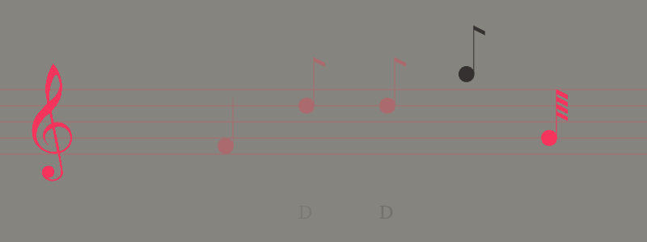
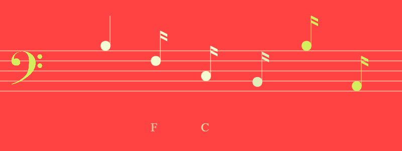
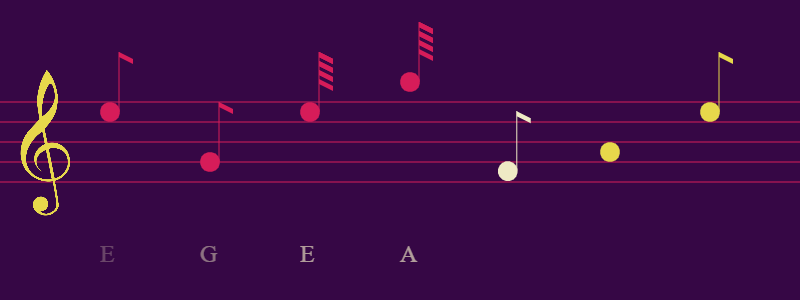

# atonanotes

A tool to memorize notes of different clefs etc. -- https://wcarss.ca/atonanotes

## What's this?

I built this simple quizzer tool to learn the notes of the bass clef. It chooses clef, puts 5-10 unlabeled notes on it, and proceeds across the staff as you type in letters that correspond to those notes. When you get to the end of them, it restarts. As you type, it briefly shows you the note that you entered to help reinforce it.

## Screenshots

## Authorship and License

Code & Design by Wyatt Carss, October 2021.

 This work is licensed under a <a rel="license" href="http://creativecommons.org/licenses/by-nc-sa/4.0/">Creative Commons Attribution-NonCommercial-ShareAlike 4.0 International License</a>.

The canvas treble and bass clefs sourced from from Robert Lie of www.mobilefish.com, used under public domain permissions released by the author. They have been slightly modified to fit this project's purposes. Exact urls and retrieval information are stored in `js/draw-clefs.js`.

Palettes originally sourced from Matt DesLaurier's [audiograph.xyz](https://audiograph.xyz), which stated that they originated from [www.colourlovers.com](https://www.colourlovers.com).